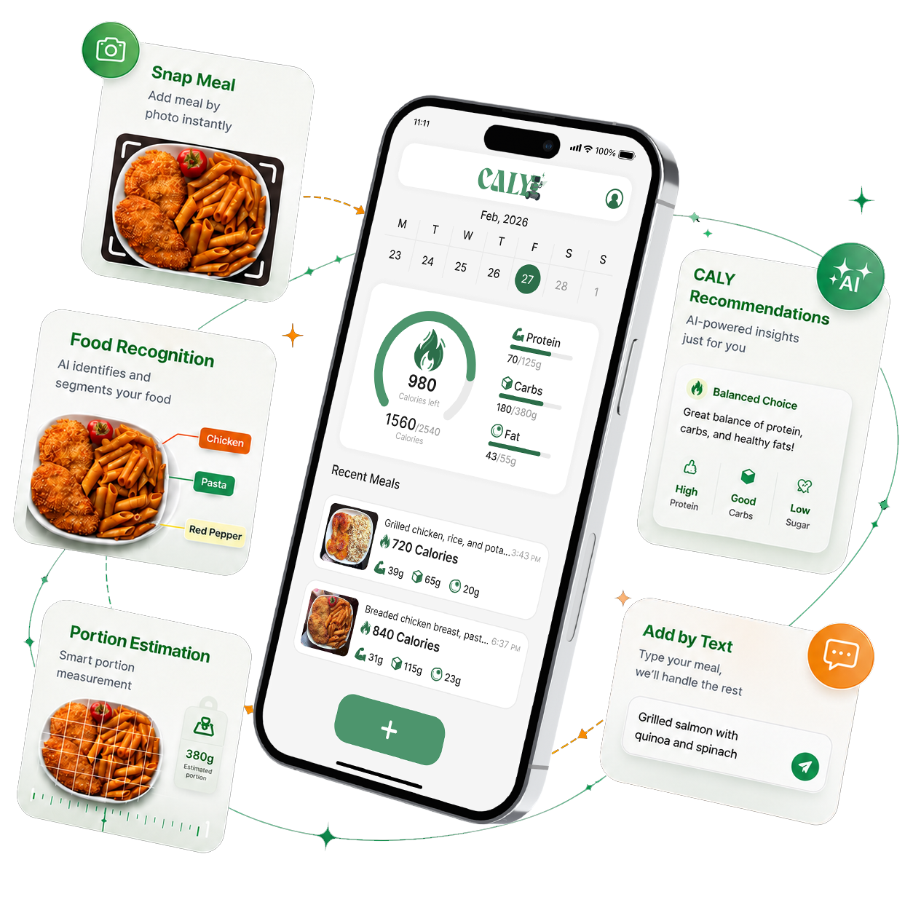

# CALY — Multimodal AI Nutrition Intelligence



CALY is an AI-powered nutrition platform that transforms a meal photo or natural-language description into recognized food items, estimated portions, nutritional values, and personalized daily guidance.

This repository contains the official website for the CALY graduation project. The website presents the project’s main capabilities, AI systems, evaluation results, mobile experience, product architecture, and Android beta version.

## Live Website

[Visit the CALY Website](https://caly-ai.pages.dev)

> Replace the link above if your Cloudflare Pages project uses a different domain.

## Android Beta

The CALY Android beta is distributed through GitHub Releases.

[Download the Latest CALY Beta](https://github.com/Caly-AI-Team/CALY-Android-APK-Releases/releases/latest/download/CALY-Beta.apk)


## About CALY

Traditional calorie tracking often requires users to separate ingredients, estimate portions, search nutritional databases, and calculate nutrition manually.

CALY simplifies this process through one connected experience:

- Capture a meal photo.
- Describe a meal using natural language.
- Log previously saved favorite meals.
- Recognize multiple foods in the same image.
- Estimate food portions without LiDAR or specialized hardware.
- Calculate calories and macronutrients.
- Compare consumption with personalized daily targets.
- Generate concise, personalized nutrition guidance.

## Main Systems

### Food Recognition

CALY uses multiple fine-tuned YOLO instance-segmentation models to recognize and separate food items at the pixel level.

The ensemble framework removes duplicate detections, resolves mask conflicts, protects nested toppings, and produces a clean final segmentation result.

- Approximately 40,000 training images
- 220 food classes
- 46 Egyptian food classes
- Pixel-level instance masks
- Custom Mask-IoU ensemble

### Portion Estimation

CALY estimates food quantity using a physical reference card and monocular depth estimation.

- CALY reference card calibration
- Pixel-to-centimeter conversion
- Depth Anything V2
- Volume estimation
- Food-density-based gram estimation
- Soft Clamping for outlier correction

### Food Description

Users can describe meals naturally instead of selecting every ingredient manually.

The language pipeline supports:

- Arabic
- Egyptian Arabic
- Franco-Arabic
- English
- Mixed-language input

The system extracts food entities, normalizes food names, interprets portions, and converts the description into structured meal data.

### Personalized Recommendations

CALY compares consumed nutrition with personalized daily targets based on the user’s profile, activity level, and goal.

The system identifies nutritional imbalances and the food contributing most to them before generating a short, mobile-friendly recommendation.

### Integrated Platform

The complete product connects:

- Flutter mobile application
- FastAPI backend
- Supabase
- Cloudinary
- AI inference services
- Nutrition calculation services
- Personalized recommendation delivery

## Website Sections

The website includes:

- Hero and project introduction
- Why CALY
- Meal logging methods
- Inside the Intelligence
- Evaluation results
- Mobile application experience
- Product architecture
- Development team
- Android closed beta
- Project footer and navigation

## Technology Stack

### Website

- HTML5
- CSS3
- Vanilla JavaScript
- Alexandria font
- Responsive layout
- Accessible navigation
- Interactive module tabs
- Image lightbox
- Scroll animations

### CALY Product

- Flutter
- Dart
- FastAPI
- Python
- Supabase
- Cloudinary
- Docker
- YOLOv8
- YOLOv11
- Depth Anything V2
- Qwen 2.5
- Gemini

## Project Structure

```text
CALY-Project-Website-V4
├── README.md
├── index.html
│
├── assets
│   ├── app
│   │   ├── Explore all interface screens.webp
│   │   ├── Home screen with cards.jpg
│   │   ├── The-mobile-experience.png
│   │   ├── home-dashboard.jpg
│   │   ├── home-menu.jpg
│   │   ├── meal-details.jpg
│   │   ├── meal-list.jpg
│   │   ├── meal-photo.jpg
│   │   ├── onboarding.jpg
│   │   └── plan-ready.jpg
│   │
│   ├── brand
│   │   ├── caly-background.svg
│   │   ├── caly-icon.svg
│   │   ├── caly-logo-white.svg
│   │   └── caly-logo.svg
│   │
│   ├── downloads
│   │   └── README.txt
│   │
│   └── images
│       ├── Food-Description.webp
│       ├── Food-Recognition.webp
│       ├── Integrated-platform.webp
│       ├── Portion-Estimation.webp
│       ├── Recomendation.webp
│       └── hero-image.png
│
├── css
│   └── styles.css
│
└── js
    └── app.js
